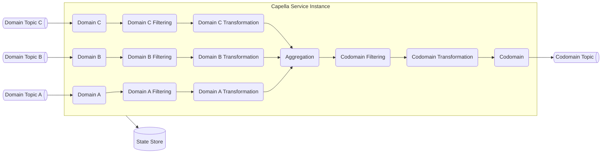

# Capella

## Status

## About

Capella is an implementation of the [Aggregator Pattern](https://www.enterpriseintegrationpatterns.com/patterns/messaging/Aggregator.html) as a standards-based microservice. It is designed to make the task of aggregating data from multiple sources within a distributed system landscape as straightforward and effortless as possible. 

Aggregating data from multiple sources is a generic capability that you shouldn’t have to implement yourself. Your expertise lies in the core capabilities of your business. 

With Capella, two steps are required to get your data aggregation up and running: 
- [Configuration](/docs/configuration.md)
- [Deployment](/docs/deployment.md)

